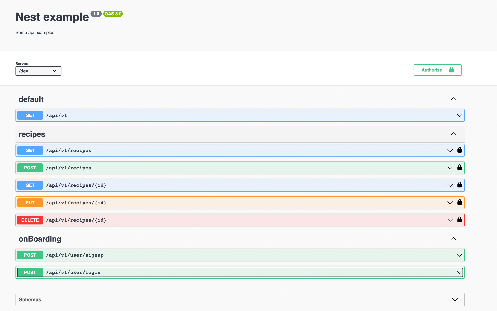

### [api documentation link](https://5io3opxq08.execute-api.us-east-1.amazonaws.com/dev/docs#/)

<br/>

<p align="center">

</p>

## Description

[Recipe Repo](https://nextjs-recipe-repo.vercel.app/) For Api

## Table of Contents

- [Recipe UI](#search-ui)

  - [Installation](#installation)
  - [Runningtheapp](#Running the app)
  - [Usage](#usage)

## Installation

To install the project, you'll need to have Node.js and Yarn installed on your machine. Once you have those installed, follow these steps:

1. Clone the repository:

   ```
   git clonehttps://github.com/shwepyihein/serverless-nestjs-cicd.git
   ```

2. Install the dependencies:

   ```
    yarn install
   ```

3. setup the envrionment:

   ```
   cd recipe-frontend
   touch .env
   ```

   ```
   JWT_SECRET=
   JWT_EXPIRE=
   MONGO_URI=
   ```

## Running the app

```bash
# development
$ yarn run start

# watch mode
$ yarn run start:dev

# production mode
$ yarn run start:prod
```

## Test

```bash
# unit tests
$ yarn run test

# e2e tests
$ yarn run test:e2e

# test coverage
$ yarn run test:cov
```

## Deploy on lambda

It is depoly with serverless and lamba wiht github action
